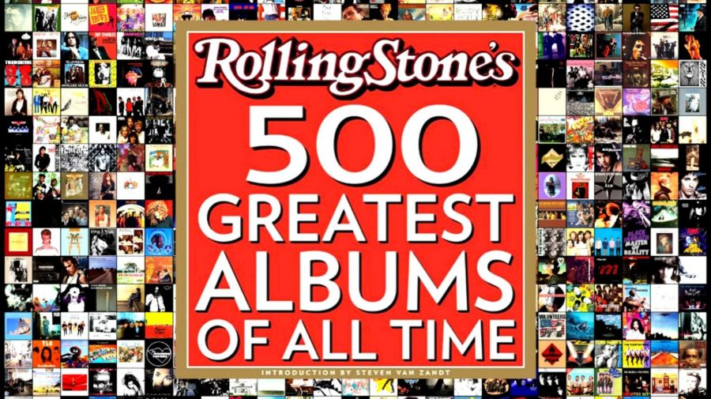

```{r global_options, include=FALSE}
#needed packages:
library(ggplot2)
library(kableExtra)
knitr::opts_chunk$set(echo = TRUE)
knitr::opts_chunk$set(warning = FALSE)
```

```{r, echo=FALSE}
p1 <- read.csv('Project1_Albums.csv')
```

------------------------------------------------------------------------

# **1. Introduction**

The dataset I will be analyzing in this project contains information about the top 500 ranked albums according to Rolling Stones in 2020. Such information includes the year it was released, genre and type of album, the number of weeks and top spot it made on the Billboard charts, and its popularity on Spotify. This data was collected by giving an opinion survey to selected musicians, critics, and industry figures and weighing votes to create a ranking.

The outcome variable of interest to me for this project is an album's Spotify popularity. This variable measures how well received an album is among Spotify listeners by assigning a numerical value to it, where higher is more popular. The predictor variables I will be investigating include what genre an album is, how many weeks an album spent on the Billboard charts, and an album's peak position on the Billboard Charts. 



# **2. Outcome Variable Distribution**

```{r, echo=FALSE, results='hide'}
ggalbum <- ggplot(p1)
ggalbum + geom_histogram(aes(x = spotify_popularity), binwidth = 3, col = "black", fill = "blue") + labs(title = "Popularity Distribution of Rolling Stones Top 500 Albums Among Spotify Listeners", x = "Spotify Popularity", y = "Frequency")
```

The graph displaying the distribution of the Spotify popularity of top 500 albums is normal and mostly symmetrical. Its average Spotify popularity rating is `r round(mean(na.omit(p1$spotify_popularity)),2)` and its median Spotify popularity rating is `r round(median(na.omit(p1$spotify_popularity)),2)`. It has a standard deviation of `r round(sd(na.omit(p1$spotify_popularity)),2)` and an IQR of `r round(IQR(na.omit(p1$spotify_popularity)),2)`. There are no statistical outliers.  

# **3. Bivariate Relationships**

In this section I will compare the bivariate relationship between the Spotify popularity of an album with what genre that album is, how many weeks that album spent on the Billboard charts, and that album's peak position on the Billboard Charts.

### **3.1 Spotify Popularity Vs. Genre**

```{r, echo=FALSE}
lep_genre <- aggregate(spotify_popularity~genre, data = p1, mean)
colnames(lep_genre) <- c("Genre", "Mean Spotify Popularity")
lep_genre$`Mean Spotify Popularity` <- round(lep_genre$`Mean Spotify Popularity`, 2)
kable_classic(kbl(lep_genre,caption = "Mean Spotify Popularity by Genre"),full_width = FALSE)
```

The average Spotify popularity of all genres is `r round(mean(na.omit(p1$spotify_popularity)),2)`. The least popular genre on Spotify is Afrobeat, with an average popularity rating of 31.50, while the most popular genre on Spotify is Latin, with an average popularity rating of 74.83. Other popular genres include Hip-Hop/Rap and Indie/Alternative Rock. Other unpopular genres include Big Band/Jazz. All other genres are fairly close to the average Spotify popularity of all genres. 

### **3.2 Spotify Popularity Vs. Weeks Spent on Billboard Charts**

```{r, echo=FALSE, results='hide'}
ggalbum + geom_point(aes(x = spotify_popularity, y = weeks_on_billboard)) + labs(title='Spotify Popularity Vs. Weeks Spent on Billboard Charts', x='Spotify Popularity',y='Weeks Spent on Billboard Charts')

p1_clean <- na.omit(p1[,c("spotify_popularity", "weeks_on_billboard")])
round(cor(p1_clean$spotify_popularity, p1_clean$"weeks_on_billboard"),2)
```

There is a moderately weak positive correlation between Spotify popularity and the number of weeks an album spent on the billboard charts. The correlation coefficient is 0.37.  This shows the longer an album spent on the billboard charts, the more popular it tends to be on Spotify.

### **3.3 Spotify Popularity Vs. Peak Position on Billboard Charts**

```{r, echo=FALSE, results='hide'}
ggalbum + geom_point(aes(x = spotify_popularity, y = peak_billboard_position)) + labs(title='Spotify Popularity Vs. Peak Position on Billboard Charts', x='Spotify Popularity',y='Peak Position on Billboard Charts')

p1_clean <- na.omit(p1[,c("spotify_popularity", "peak_billboard_position")])
round(cor(p1_clean$spotify_popularity, p1_clean$"peak_billboard_position"),2)

#subset of albums that peaked within top 10 on the billboard 
p1_top <- na.omit(p1[p1$peak_billboard_position <= 10,])
round(cor(p1_top$spotify_popularity, p1_top$peak_billboard_position),2)

```

There is a moderate negative correlation between Spotify popularity and the peak position an album reached on the billboard charts. The correlation coefficient is -0.43. This shows the higher an album peaked on the billboard charts, the more popular it is on Spotify.

There is little difference in the correlation between Spotify popularity and albums that peaked within the top 10 on the billboard charts. The correlation coefficient is also moderately negative at -0.40.This shows the higher an album peaked on the billboard charts, the more popular it is on Spotify. It is surprising that the correlation between Spotify popularity and peak album position is weaker for albums that peaked within the top 10 on the billboard charts, but this could be explained by changing music tastes over time. 

### **3.4 Multivariate Graph**

```{r, echo=FALSE}
ggalbum + geom_point(aes(x = spotify_popularity, y = weeks_on_billboard, col = genre)) + labs(title='Spotify Popularity Vs. Weeks Spent on Billboard Charts Grouped by Genre', x='Spotify Popularity',y='Weeks Spent on Billboard Charts') + theme(legend.position='bottom') + scale_fill_brewer(type='qual',palette=2) + facet_wrap(~genre)
```

The results of this graph reveal that some genres have never spent time on the billboard charts, such as Afrobeat, while other genres have only had a few albums make it to the billboard charts, including Big Band/Jazz and Latin. The genres with the most albums on the billboard charts are Indie/Alternative Rock, Hip-Hop/Rap, Country/Folk/Country Rock/Folk Rock, Soul/Gospel/R&B, and NA, which I take to be albums that could not be neatly classified into one of the other genres. The genres with albums that spent the most time on the billboard charts include Hip-Hop/Rap, Soul/Gospel/R&B, and NA. 

# **4. Choice Elements**

The 5 choice elements I included in this project were:

- 4 in-line codes in section 2 to report the correct descriptive statistics.

- 2 working hyperlinks in the references part of section 5 to provide more information on the albums dataset, including the methodology behind how it was made and the actual full list.

- A floating table of contents.

- A subset of the original dataset in section 3.3 to see if there was any difference between the Spotify popularity of albums that reached a top 10 spot on the billboard charts and all albums that made it to the billboard charts.

- A multivariate plot at the end of my bivariate analysis section to reveal how many and how long albums of different genres spent on the billboard charts. 

# **5. Conclusion**

There seems to be a moderate amount of evidence to show how well an album was received upon release, at least according to billboard metrics, is indicative of how well an album is received now, based on Spotify popularity ratings. As an album's peak position on the billboard charts tends towards one, the Spotify popularity ranking generally increases. And as an album spends more weeks being on the billboard charts, it will generally have a higher Spotify popularity rating. Some potential areas of future research can include tracking the Spotify popularity of different albums through time to see how musical trends change across generations. We can also look more into the Spotify popularity of an album in a particular region by categorizing our data by geographical location. 

References: 

[Click here to read more about what makes an album great.](https://pudding.cool/2024/03/greatest-music/)

[Click here to see the full top 500 albums list on the official Rolling Stones website.](https://www.rollingstone.com/music/music-lists/best-albums-of-all-time-1062063/jay-z-the-blueprint-3-1063183/)
